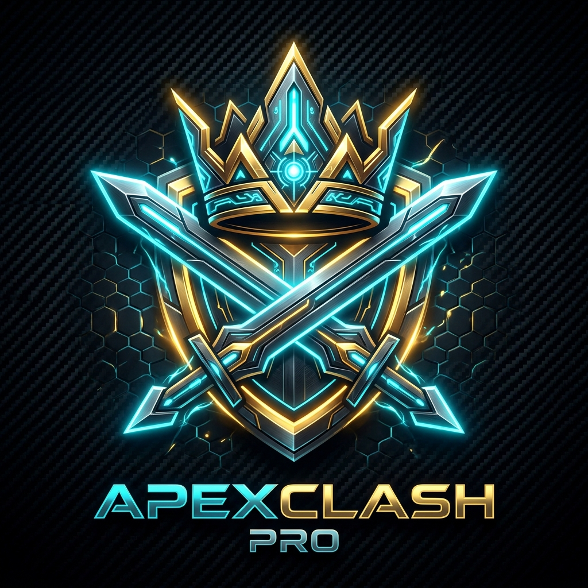

<div align="center">



# ⚔️ ApexClash Pro
### *The Ultimate Autonomous Farming, Combat & Humanized Anti-Ban Suite for Clash of Clans*

[](https://github.com/keshav-x/coc-bot/releases)
[](https://github.com/keshav-x/coc-bot/releases)
[](https://github.com/keshav-x/coc-bot)
[](https://github.com/keshav-x/coc-bot)
[](https://github.com/keshav-x/coc-bot)

<p align="center">
  <b>100% External Vision</b> • <b>Humanized Bézier Movement</b> • <b>Zero Memory Injection</b> • <b>24/7 Automated Loot Velocity</b>
</p>

[**📥 Download Latest Release**](https://github.com/keshav-x/coc-bot/releases/tag/v1.2) • [**🔑 View Passes & Pricing**](#-access-passes--pricing) • [**💬 Join Support on Discord**](https://discord.com)

</div>

---

## 📖 About ApexClash Pro

**ApexClash Pro** is a high-velocity, fully autonomous combat and resource-harvesting bot engineered specifically for **Clash of Clans**. Designed for players who want to max out walls, heroes, and defenses without spending thousands of hours grinding, ApexClash Pro automates base searches, dead-base filtering, tactical troop deployments, wall upgrading, and multi-account rotations.

Built from the ground up with **pure computer vision** and **humanized behavioral physics**, ApexClash Pro never injects code or tampers with game memory, giving you uninterrupted farming velocity with unmatched account safety.

---

## 🛡️ Next-Gen Anti-Ban Architecture 3.0

Account safety is our highest priority. Unlike unsafe cheat tools that hook into game memory, modify network packets, or inject DLLs, ApexClash Pro operates **100% externally** using advanced visual intelligence:

- 👁️ **Pure External Screen Vision**: ApexClash Pro interacts with your game exactly like a human player looking at a monitor. It captures frames from the desktop, identifies elements with OpenCV template matching, and reads loot numbers via OCR. **Zero memory reading, zero memory writing, zero file modification.**
- 🖱️ **Natural Bézier 3.0 Mouse Physics**: Robotic straight-line clicks are instantly flagged by modern heuristics. ApexClash Pro uses cubic Bézier curves with randomized control points, natural acceleration, deceleration, and micro-hand tremor to simulate genuine human hand movement.
- 🎯 **Gaussian Coordinate Scatter**: Clicks and troop drops never hit the exact same pixel twice. Coordinates are perturbed using a two-dimensional Gaussian distribution centered over the target area.
- ☕ **Circadian Fatigue & Rest Cycles**: Continuous 24-hour play is an obvious red flag. ApexClash Pro features configurable break routines, humanized micro-pauses between attacks, and optional sleep schedules to perfectly mimic human gaming sessions.
- ⏱️ **Erratic Timing Jitter**: Delays between base searches, button presses, and deployment waves are randomized with variable non-linear curves, preventing fixed-interval detection signatures.
- 🎮 **Compatible with Official & Emulator Clients**: Runs seamlessly on **Google Play Games on PC** (recommended official client), **BlueStacks 5**, **LDPlayer 9**, and **MuMu Player**.

---

## ⚡ Supercharged Features

### 1. 💰 Surgical Sneaky Goblin Farming
- Targets exterior Gold Mines, Elixir Collectors, and Dark Elixir Drills with laser precision.
- Drops minimal troops per collector to maximize loot per raid while keeping troop costs negligible.
- Farms hundreds of millions of gold and elixir per day on autopilot.

### 2. 🔍 Real-Time Smart Loot Filtration & OCR
- Automatically reads available Gold, Elixir, and Dark Elixir numbers before deciding to attack.
- Instantly skips unprofitable or active defender bases.
- Target dead bases with 800,000+ or 1,000,000+ loot thresholds to ensure every attack is high-yield.

### 3. 🧱 Autonomous Wall Upgrader
- Never lose loot to full storages again!
- Automatically detects excess Gold and Elixir and sinks it into your lowest-level walls between raids.
- Effortlessly maxes your Town Hall walls in record time.

### 4. ⚔️ Versatile Army Strategies
- **Sneaky Goblins**: Resource stripping and Town Hall sniping.
- **Electro Dragons & Balloon Funneling**: High-damage aerial perimeter destruction.
- **Valkyries & Super Minions**: Fast ground funneling and core destruction.
- **Baby Dragons & Night Witches**: Builder Base autonomous harvesting.

### 5. 👑 Tactical Hero Deployment & Timed Abilities
- Drops Barbarian King, Archer Queen, Grand Warden, and Royal Champion at designated assault vectors.
- Features **Delayed Ability Triggering (8–12s)**: Holds Iron Fist, Royal Cloak, and Eternal Tome until heroes penetrate outer walls and enter intense defense fire.

### 6. 📊 Real-Time Cockpit & Session Telemetry
- Live Dark-Mode Dashboard with estimated **Gold/hr, Elixir/hr, and Dark Elixir/hr** velocities.
- Detailed raid history table logging loot gathered, base search counts, and session runtimes.

### 7. 📱 Discord Webhook Notifications
- Receive instant notifications directly to your phone or Discord server:
  - Raid completion embeds with total loot gathered.
  - Break notifications and scheduled rest alerts.
  - Session summaries and error recovery alerts.

---

## 🚀 1-Click Installation & Launch Guide

ApexClash Pro is designed to be completely zero-friction on every major operating system:

### 🪟 Windows (1-Click Run)
1. Download **`ApexClashPro-Windows-x64.zip`** from [GitHub Releases](https://github.com/keshav-x/coc-bot/releases/tag/v1.2).
2. Extract the ZIP folder.
3. Double-click **`ApexClashPro.exe`** to launch! *(Or double-click `start_windows.bat` if running from source)*.

### 🐧 Linux (1-Click Setup)
Full support for **Fedora**, **Ubuntu**, **Debian**, and **Arch Linux**:

#### ⚡ Universal 1-Line Git Command (Clone, Install & Run):
On any Linux distribution, simply paste this one command into your terminal:
```bash
git clone https://github.com/keshav-x/coc-bot.git && cd coc-bot && chmod +x install_linux.sh start_linux.sh && ./install_linux.sh
```
*The script auto-detects your distribution, configures required libraries, sets up the virtual environment, creates an **ApexClash Pro** desktop shortcut, and starts the bot!*

#### 📦 Distro-Specific Prerequisites (Manual / Source):
If you prefer to install system dependencies manually before running:

- **Fedora / RHEL (DNF / DNF5)**:
  ```bash
  # Fedora uses dnf (or dnf5 on Fedora 41+)
  sudo dnf install -y python3 python3-pip python3-devel mesa-libGL glib2 libxkbcommon-x11 xcb-util-cursor tesseract tesseract-devel git
  ```
- **Ubuntu / Debian (APT)**:
  ```bash
  sudo apt-get update && sudo apt-get install -y python3 python3-pip python3-venv python3-dev libgl1 libglib2.0-0 libxkbcommon-x11-0 libxcb-cursor0 tesseract-ocr git
  ```
- **Arch Linux (Pacman)**:
  ```bash
  sudo pacman -Sy --noconfirm python python-pip mesa glib2 libxkbcommon xcb-util-cursor tesseract git
  ```

#### 🚀 Daily Launch:
After installation, start ApexClash Pro anytime with:
```bash
./start_linux.sh
```
*(Or double-click the **ApexClash Pro** icon on your Desktop / Application Menu).*

### 🍎 macOS (1-Click Finder Launch)
1. Download **`ApexClashPro-macOS-Universal.zip`** from [GitHub Releases](https://github.com/keshav-x/coc-bot/releases/tag/v1.2).
2. Extract the archive in Finder.
3. **Double-click `start_mac.command`** directly in Finder. It will configure the environment and open ApexClash Pro immediately!

---

## 🎮 Game & Emulator Setup

ApexClash Pro is pre-calibrated to work out of the box with standard game resolutions:

1. **Supported Clients**:
   - **Google Play Games on PC** *(Recommended official client)*
   - **BlueStacks 5**
   - **LDPlayer 9**
   - **MuMu Player / Nox**
2. **Display Settings**:
   - Resolution: **1920×1080** (16:9) or **1920×1200** (16:10).
   - In-game language: **English**.
3. **Window Selection**:
   - Launch Clash of Clans.
   - In ApexClash Pro, navigate to **Settings → Game Window** to select or auto-detect your game window.

---

## 💎 Access Passes & Pricing

ApexClash Pro includes an automatic **2-Hour Free Trial** on first launch — test every single strategy, filter, and feature risk-free with zero commitment!

| Pass Tier | Price | Validity | Features |
| :--- | :--- | :--- | :--- |
| **⚡ Free Trial** | **FREE** | 2 Hours | Full Access, Instant Activation, No Card Required |
| **🌟 Weekly Pass** | **$1.00** | 7 Days | Full Access, Autonomous Farming, Smart Loot Filter |
| **🚀 Monthly Pass** | **$3.00** | 30 Days | Full Access, Autonomous Farming, Smart Loot Filter |
| **👑 Annual Pass** | **$10.00** | 365 Days | Full Access, All Future Updates, Priority Support |
| **💎 Lifetime VIP** | **$15.00** | **Permanent** | Lifetime Access, All Major Upgrades, VIP Priority Support |

---

## 🛒 How to Order an Activation Key

> 🌐 **Live Web Store**: Visit the official [**ApexClash Pro Purchase Portal**](https://keshav-x.github.io/coc-bot/) to configure your pack, select your payment method (PayPal, UPI, Crypto, Cards), and order with 1 click!

1. Launch **ApexClash Pro** and navigate to the **License** page (or use the web store above).
2. Click **📋 Copy Device ID** to copy your unique ID to your clipboard.
3. Send a message to the developer with your Device ID and chosen pass tier:
   - 📧 **Email**: [cockingkeshav@gmail.com](mailto:cockingkeshav@gmail.com)
   - 💬 **Discord**: `matrix0456`
   - 🌐 **Reddit**: `u/post_matrix`
4. **Accepted Payments**: PayPal, Crypto (USDT, BTC, LTC), UPI, Credit/Debit Cards.
5. Activation keys are delivered instantly upon payment confirmation!

---

## 🔍 Tags & Keywords
`clash-of-clans-bot` `coc-bot` `clash-bot` `clash-of-clans-automation` `coc-farming-bot` `sneaky-goblin-farm` `anti-ban` `opencv` `tesseract-ocr` `supercell-bot` `clash-bot-2026` `auto-loot` `wall-upgrader` `dead-base-finder` `macos-clash-bot` `windows-clash-bot` `linux-clash-bot`

---

## ⚖️ Disclaimer

*ApexClash Pro is an independent game automation utility developed solely for educational and research purposes in computer vision. Clash of Clans is a registered trademark of Supercell Oy. ApexClash Pro is not affiliated with, authorized, or endorsed by Supercell.*
